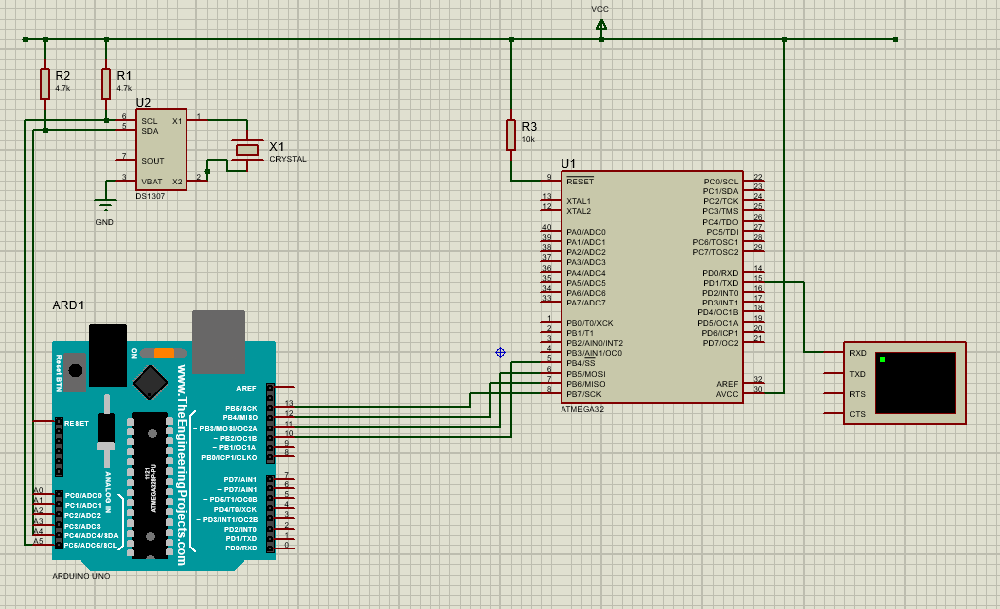
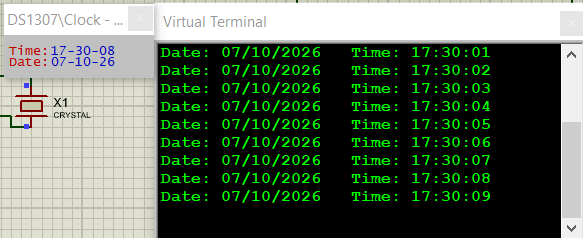

# Embedded Systems Lab 1 - Communication Protocols

A Proteus-based embedded systems project that demonstrates communication between two different MCUs using multiple communication protocols.

## Project Overview

The system reads the date and time from a DS1307 Real-Time Clock and transfers the data through multiple communication stages.

```text
DS1307 RTC -> I2C -> Arduino UNO -> SPI -> ATmega32 -> UART -> Virtual Terminal
```

## Microcontrollers

- Arduino UNO - Master MCU
- ATmega32 - Slave MCU

## Communication Protocols

| Protocol | Communication |
|----------|---------------|
| I2C | DS1307 RTC -> Arduino UNO |
| SPI | Arduino UNO -> ATmega32 |
| UART | ATmega32 -> Virtual Terminal |

The project demonstrates three communication protocols:

- I2C
- SPI
- UART

## System Architecture

```text
          DS1307 RTC
              |
             I2C
              |
              v
        +-------------+
        | Arduino UNO |
        | SPI Master  |
        +------+------+
               |
              SPI
       SS / MOSI / MISO / SCK
               |
               v
        +-------------+
        |  ATmega32   |
        |  SPI Slave  |
        +------+------+
               |
              UART
               |
               v
       +------------------+
       | Virtual Terminal |
       +------------------+
```

## How the System Works

1. The Arduino UNO communicates with the DS1307 RTC through I2C.
2. The Arduino reads the day, month, year, hour, minute, and second.
3. The values are packed into an SPI frame.
4. Arduino UNO acts as the SPI Master.
5. ATmega32 acts as the SPI Slave.
6. The ATmega32 receives the frame and validates it using a checksum.
7. The ATmega32 formats the received date and time.
8. ATmega32 sends the formatted output through UART.
9. The result is displayed on the Proteus Virtual Terminal.

## SPI Packet Format

The Arduino sends the following frame:

```text
[0xAA][DAY][MONTH][YEAR][HOUR][MINUTE][SECOND][CHECKSUM]
```

`0xAA` is used as the packet start byte.

The checksum is calculated using XOR:

```text
Checksum = Day ^ Month ^ Year ^ Hour ^ Minute ^ Second
```

The ATmega32 recalculates the checksum before displaying the received data.

## Wiring

### DS1307 to Arduino UNO - I2C

| DS1307 | Arduino UNO |
|--------|-------------|
| SDA | A4 |
| SCL | A5 |
| VCC | +5V |
| GND | GND |

Two 4.7 kOhm pull-up resistors are connected to SDA and SCL.

### Arduino UNO to ATmega32 - SPI

| Arduino UNO | ATmega32 |
|-------------|----------|
| D10 / SS | PB4 / SS |
| D11 / MOSI | PB5 / MOSI |
| D12 / MISO | PB6 / MISO |
| D13 / SCK | PB7 / SCK |

### ATmega32 to Virtual Terminal - UART

| ATmega32 | Virtual Terminal |
|----------|------------------|
| PD1 / TXD | RXD |

UART configuration:

```text
Baud Rate : 9600
Data Bits : 8
Parity    : None
Stop Bits : 1
```

## ATmega32 Configuration

The ATmega32 project is compiled using MightyCore.

```text
MCU        : ATmega32
Clock      : Internal 8 MHz
Pinout     : Standard
Bootloader : No Bootloader
JTAG       : Disabled
```

Proteus configuration:

```text
Clock Frequency : 8 MHz
CKSEL Fuse      : Internal RC 8 MHz
```

## Drivers

The ATmega32 project contains separate low-level drivers for USART and SPI.

### USART Driver

Files:

```text
USART_Driver.h
USART_Driver.cpp
```

Main functions:

```cpp
USART_init();
USART_send();
USART_receive();
USART_sendString();
USART_send2Digits();
```

The USART driver directly configures the ATmega32 UART registers and provides reusable functions for serial communication.

### SPI Driver

Files:

```text
SPI_Driver.h
SPI_Driver.cpp
```

Main functions:

```cpp
SPI_Init();
SPI_ReceiveData();
SPI_SendReceiveData();
```

`SPI_ReceiveData()` is used by the final mini project because the ATmega32 works as an SPI slave receiving data from the Arduino UNO.

`SPI_SendReceiveData()` is also implemented as part of the complete SPI driver functionality required by the lab.

## Project Structure

```text
Embedded-Lab1-Communication-Protocols/
|
├── Arduino_Master/
|   └── RTC_Arduino_Master/
|       └── RTC_Arduino_Master.ino
|
├── ATmega32_Slave/
|   └── ATmega32_SPI_Slave/
|       ├── ATmega32_SPI_Slave.ino
|       ├── USART_Driver.h
|       ├── USART_Driver.cpp
|       ├── SPI_Driver.h
|       └── SPI_Driver.cpp
|
├── Proteus/
|   └── Lab1_Communication_Protocols.pdsprj
|
├── Screenshots/
|   ├── Circuit.png
|   └── VirtualTerminal.png
|
└── README.md
```

## Proteus Circuit



## Simulation Result



The Virtual Terminal displays the date and time received from the RTC through the complete communication chain.

Example output:

```text
Date: 07/10/2026   Time: 17:30:01
Date: 07/10/2026   Time: 17:30:02
Date: 07/10/2026   Time: 17:30:03
```

## Software Used

- Proteus 8 Professional
- Arduino IDE
- MightyCore

## Result

The simulation successfully demonstrates:

- I2C communication
- SPI communication
- UART communication
- RTC data transfer
- Communication between Arduino UNO and ATmega32
- Date and time display on the Virtual Terminal
